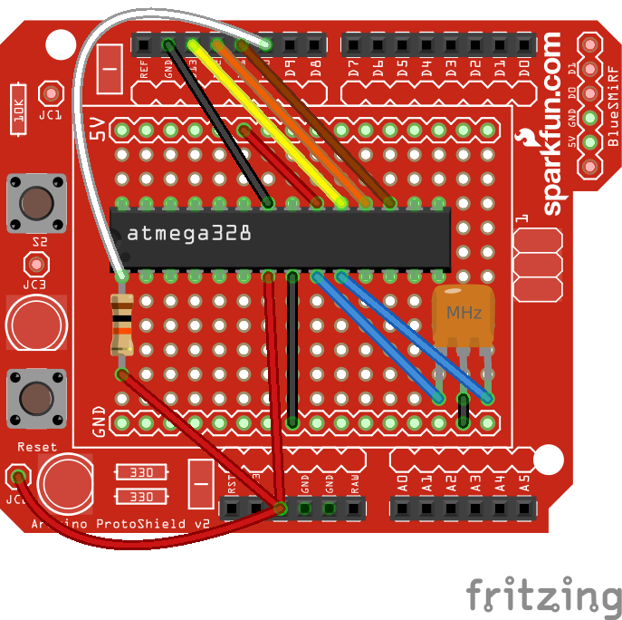
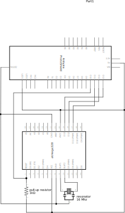

# flashielduino

Arduino shield to flash atmega328(p) AVR microcontroller

inspired by [Adafruit ArduinoISP tutorial](https://learn.adafruit.com/arduino-tips-tricks-and-techniques/arduino-uno-faq?view=all#arduinoisp),
but actually using a pull-up 1kΩ resistor and 16Mhz resonator.

I've had better results with the pull-up res, and the resonator is handy so
that the shield doesn't rely on the sketch providing a clock. Note that
[Nick's Gammon sketches](https://github.com/nickgammon/arduino_sketches) do
provide a 8Mhz clock on pin 9.

