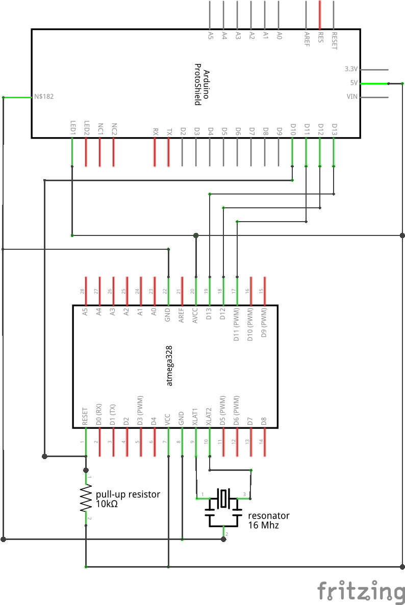

# flashielduino

Arduino shield to flash atmega328(p) AVR microcontroller

inspired by [Adafruit ArduinoISP tutorial][adafruit-arduino-isp] and [From
Arduino to a Microcontroller on a Breadboard][arduino-to-breadboard], with the
pull-up 10kΩ resistor and a 16Mhz resonator. Placement of the Atmega328p
MCU is that way because I am using a
[28-pin ZIF Socket](https://www.sparkfun.com/products/9175).

I've had better results with the pull-up res, and the resonator is handy so
that the shield doesn't rely on the sketch providing a clock. Note that
[Nick's Gammon sketches](https://github.com/nickgammon/arduino_sketches) do
provide a 8Mhz clock on pin 9.

[adafruit-arduino-isp]:  https://learn.adafruit.com/arduino-tips-tricks-and-techniques/arduino-uno-faq?view=all#arduinoisp
[arduino-to-breadboard]: https://www.arduino.cc/en/Tutorial/ArduinoToBreadboard
